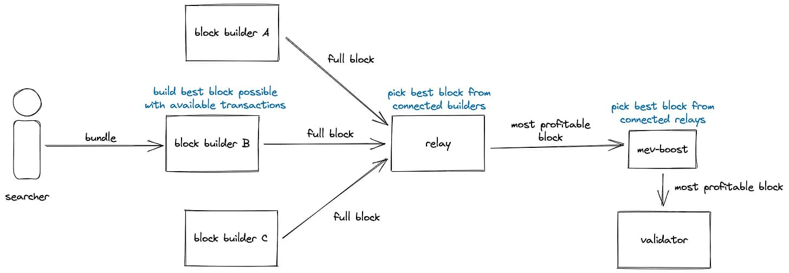
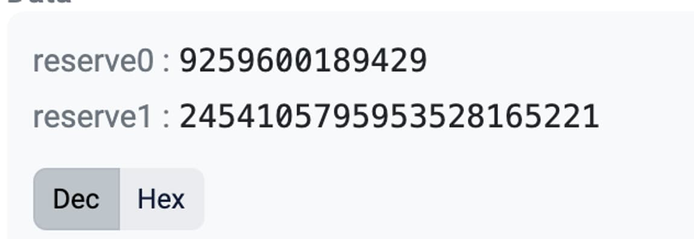
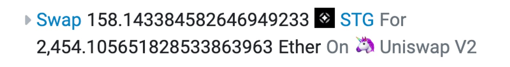

Authors: [Skeletor Spaceman,](https://twitter.com/Skeletor_Space) [ng,](https://twitter.com/ngndev) [parti](https://twitter.com/0xParticle)

## Race pits

The early days of speed racing were characterized by a lawless and perilous environment, with few regulations and countless hazards. It was an era in which both man and machine pushed the limits of what was possible, driven by the pursuit of glory and the ultimate prize.

You are a skilled and daring racer, who has dedicated his life to preparing for this very moment. The roar of the crowds amplifies as you rev your engine, eagerly anticipating the signal that will propel you down the track at lightning speed. You are acutely aware of the risks: the sharp turns, the narrow straights, and the ruthless competitors who will stop at nothing to achieve victory.

Yet, fear does not grip you. You have undergone rigorous training and know your vehicle inside and out. As the signal is given, you take off, racing down the track at a velocity that appears implausible. The wind whips past you, and you revel in the excitement and intensity of the race, recognizing that the triumph is well within your reach.

You navigate turns at impossible speeds, narrowly avoiding collisions with other drivers as you push your car to its very limits. However, calamity soon befalls close to you. A tire suddenly bursts, propelling your rival off the track and into the wall at an astonishing rate.

His vehicle is now a mangled wreck, and he is trapped inside, immobile. The spectators let out horrified screams as they witness his futile attempts to escape. Unfortunately, the damage is irreversible, and you realize that his life is now on the line.

You feel the crushing weight of your mortality bearing down on you. He was a racer, just like you. An individual who existed solely for the thrill of the competition. Yet, that very thrill has brought about his demise.


The Merge event in Ethereum has unleashed a host of dangers in the [Ethereum Dark Forest](https://www.paradigm.xyz/2020/08/ethereum-is-a-dark-forest). These beasts now roam the woods, waiting for unsuspecting victims to fall into their trap. The [recent attack](https://twitter.com/samczsun/status/1642848556590723075) on MEV bots was likely just the first of many such events, and we can expect more to come.

In this blog post, we will not only introduce you to some of these new and unprecedented beasts, but also provide you with the tools you need to protect yourself against them. This is only the beginning of our quest to find and combat these beasts, as we continue to search for more.

### Thread carefully, racer, for the roots of the dark forest lie in wait, ready to trip you up.

## Dark Forest, April the 3rd

A few weeks ago, the world of MEV was shocked by a novel attack that saw an [attacker](https://etherscan.io/address/0x3c98d617db017f51c6a73a13e80e1fe14cd1d8eb) make off with a staggering $20 million USD by taking advantage of a vulnerability in the code of the Flashbots MEV-Boost relay. The attacker, who was actually the block proposer for the time slot, reorganized the transactions to steal from sandwich bots in the proposed [block](https://etherscan.io/block/16964664).

To understand what led to the current situation, it is essential to comprehend the concept of Proposer-Builder Separation (PBS) and "Blind blocks." For a comprehensive introduction to the subject, I recommend reading the appendix:

[A racing story: appendix](https://www.notion.so/A-racing-story-appendix-1d3670094fb94572bc4c3f73347e1112?pvs=21)

In summary, PBS distinguishes the two roles responsible for generating new blocks in the blockchain network: the Proposer and the Builder. One noteworthy aspect of this separation is the ability of validators to use Blind blocks. This technique enables validators to sign a block's header without viewing its contents, making the signature valid for the entire block once it is revealed. The [Flashbots MEV-Boost](https://ethresear.ch/t/mev-boost-merge-ready-flashbots-architecture/11177?u=benjaminion) design leverages this technique to provide a fair and efficient way for miners to extract value from the mempool.



_How was the proposer able to view the content of the block if Flashbots relay uses Blind blocks?_

Proposers who use [mev-geth](https://github.com/flashbots/mev-geth) are required to sign the block header before receiving the block content from the relay to broadcast. Once the relay receives the signed header, it immediately broadcasts the block to the entire network. If the proposer were to sign and send a different block afterward, they would be at a significant disadvantage, as a large part of the network has already attested to the relays block.

However, there was a loophole. The relay did not verify the validity of the signed block header and would try to broadcast it regardless. Although the beacon chain would naturally reject the block sent by the relay, the relay would still disclose the block's contents to the proposer. This gave the proposer an opportunity to modify transactions and broadcast a modified block uncontested to the entire network, giving them an unfair advantage. This is exactly what the attacker used on April the 3rd.

<div class="twitter-player">
<iframe  style="border:none;" width="550" height="630" src="data:text/html;charset=utf-8,%3Cblockquote%20class%3D%22twitter-tweet%22%20data-dnt%3D%22true%22%20data-theme%3D%22light%22%3E%3Cp%20lang%3D%22en%22%20dir%3D%22ltr%22%3EBlock%2016964664%3A%20A%20user%20managed%20to%20drain%20five%20MEV%20bots%20by%20exploiting%20a%20bug%20in%20mev-boost-relay.%3Cbr%3E%3Cbr%3EHere%26%2339%3Bs%20the%20block%3A%20%3Ca%20href%3D%22https%3A//t.co/ruSz8YzAJR%22%3Ehttps%3A//t.co/ruSz8YzAJR%3C/a%3E%3Cbr%3EHere%26%2339%3Bs%20the%20user%3A%20%3Ca%20href%3D%22https%3A//t.co/VY4gpmX0L8%22%3Ehttps%3A//t.co/VY4gpmX0L8%3C/a%3E%3Cbr%3EHere%26%2339%3Bs%20the%20patch%3A%20%3Ca%20href%3D%22https%3A//t.co/TPO80i3dz5%22%3Ehttps%3A//t.co/TPO80i3dz5%3C/a%3E%3Cbr%3EHere%26%2339%3Bs%20the%20longer%20explanation%3A%20%3Ca%20href%3D%22https%3A//t.co/NIe2QJxNGE%22%3Epic.twitter.com/NIe2QJxNGE%3C/a%3E%3C/p%3E%26mdash%3B%20@samczsun.com%20%28@samczsun%29%20%3Ca%20href%3D%22https%3A//twitter.com/samczsun/status/1642848556590723075%3Fref_src%3Dtwsrc%255Etfw%22%3EApril%203%2C%202023%3C/a%3E%3C/blockquote%3E%0A%3Cscript%20async%20src%3D%22https%3A//platform.twitter.com/widgets.js%22%20charset%3D%22utf-8%22%3E%3C/script%3E%0A%3Cstyle%3Ehtml%7Boverflow%3Ahidden%20%21important%3B%7D%3C/style%3E"></iframe>
</div>

The proposer's behavior of signing two headers in the same slot is a **[slashable offense](https://twitter.com/terencechain/status/1642898223076614144)**. However, the penalty for such an offense is a meager amount of 1ETH and rewards for the subsequent 36 days. This penalty is a minor cost compared to the potential profit gained from such an act.

However, Flashbots has taken measures to address this issue by implementing a **[patch](https://github.com/flashbots/mev-boost-relay/pull/330)**. This patch ensures that the relay checks whether their block has been successfully published before revealing the block's content to the proposer, mitigating the risk of such attacks in the future.

If you still find this flow a bit confusing, take a moment to watch this great video by [EigenPhi](https://eigenphi.io/).

<iframe class="ytplayer" type="text/html"
  src="https://www.youtube.com/embed/_0gItL8IyPQ"
  frameborder="0"></iframe>

During the investigation, a second attack was also discovered: a proposer with two consecutive slots could delay requesting the block from the relay until the end of the first slot. Although this would cause the proposer to miss the slot, they would still receive the block content and could use it to include a modified block in the following slot.

The recent patch also addresses this vulnerability. After a certain period has elapsed, the relay will no longer provide the block's content to the proposer. The initial time limit was set at 3 second. You can read a lot more details in the [Flashbot’s post-mortem](https://collective.flashbots.net/t/post-mortem-april-3rd-2023-mev-boost-relay-incident-and-related-timing-issue/1540).

The same attacker notified the flashbots team about another possible attack. A proposer could call the `getPayload()` function before the begining of their slot and then try to race the relay’s block by equivocating. A [new patch](https://github.com/flashbots/mev-boost-relay/commit/d7b3849b7ee101562b9e715f7c85015cf7fef5d5) was created to address this issue. You can read more about this in the [Flashbot’s disclosure](https://collective.flashbots.net/t/disclosure-mitigation-of-block-equivocation-strategy-with-early-getpayload-calls-for-proposers/1705).

## We are safe…right?

Although the recent patches have reduced the risk of attacks, it has not entirely eliminated the possibility of malicious proposers gaming the system. There are still two known ways in which this can happen:

1. Same time slot race: When the relay receives the signed header, it immediately broadcasts the block to the Ethereum network. If the block is successfully posted, the relay waits for one second before revealing the content to the proposer, creating a delay that gives the Flashbots block a lead. However, the proposer could also listen to the network and bypass this delay. If the proposer has a strong connection and is close to the relay servers, they could try to race against the Flashbots block. This is a network engineering problem.
2. Multiblock: If the proposer has two consecutive blocks, the attack becomes orders of magnitude more likely. The attack would work as follows:
   1. The proposer broadcasts a valid empty block or grabs transactions from the public-mempool.
   2. Then the proposer waits for a bit and requests and signs the Flashbots block.
   3. Now the Flashbots block will be at a disadvantage due to the proposer block having a head start.
   4. If attester majority is reached for the first block from the proposer, all transactions from the Flashbots block will be vulnerable for replaying, since they are not part of the chain.
   5. The proposer modifies the Flashbots block, extracts value, and proposes the modified block on his consecutive slot.


The chances of a malicious validator winning a race in the same block are “““low”””. However, multiblock attacks are a **very real and serious concern**. Validators from large validator pools, such as Coinbase, Binance, Lido, and Rocketpool, hold a significant portion of the validator power. There is a [high probability](https://alrevuelta.github.io/posts/ethereum-mev-multiblock) that stakers will propose multiple blocks in a row, and coordination among validators is also possible if the potential reward is significant. This was also one of the main reasons we built [PRICE](https://oracles.rip), an oracle that is able to detect and correct [TWAP multiblock manipulations](https://defi.sucks/insights/oracle-manipulation-101).

## Attack breakdown

Proposers who gain access to the Flashbots block have a significant advantage in terms of value extraction opportunities. By accessing this block, they can extract more value than what is typically possible through common MEV extraction techniques. This is because proposers can directly extract value from MEV bots themselves, which are usually blind to them.

One particularly [profitable MEV transaction](https://eigenphi.io/) is known as a ["sandwich attack"](https://www.defi-sandwi.ch/), where bots search for AMM swap transactions that they can bundle between a front-run and back-run. This allows the bot to extract slippage from the transaction. Sandwich attacks often create large transactions in the bundle. Conceptually, a sandwich attack can be viewed as an optimization to a traditional arbitrage or positive MEV scenario, where the bot restores the impacted price of the pool.

If the proposer opens the Flashbot block and sees a sandwich transaction, there are two attacks they can attempt:

1. Sandwich the sandwich: While it may seem possible for a proposer to sandwich a sandwich attack, this would only be feasible if the bots involved in the original sandwich attack had set a high slippage. However, our analysis of the contracts used by sandwich bots revealed that they all use a very tight slippage check value, which makes this type of attack impractical.
2. Back-run the front-run (or front-run the back-run): After the sandwich front-run transaction, the pool would be temporarily in a manipulated price. The proposer can include this transaction and then bring the pool back to the initial price. Once the pool price is restored, the proposer can close the arbitrage in a secondary market with plenty of time to minimize the price impact.

On April 3rd, the attacker employed a clever strategy to exploit the bots. They crafted a high slippage transaction as bait in low liquidity Uniswap v2 pools and then back-runned the sandwich's front-run transactions. This strategy can be seen in the whole block, available at **[this link](https://etherscan.io/txs?block=16964664)** or on **[this page](https://eigenphi.io/mev/eigentx/0xd2edf726fd3a7f179c1a93343e5c0c6ed13417837deb6fc61601d1ce9380e8dc?tab=block).**

_But how profitable is this? How does the attacker know the amounts to manipulate?_

Let's take a closer look at the profitability of one of these attacks, specifically the one that targeted the STG/WETH pool.

- [Sandwich frontrun transaction](https://etherscan.io/tx/0xd2edf726fd3a7f179c1a93343e5c0c6ed13417837deb6fc61601d1ce9380e8dc)
- [Proposer’s backrun](https://etherscan.io/tx/0x4b2a2d03b3dc136ef94ebe2f3bc36231b104172bcb598104730898f7d81a55db)

The other attacks in the block followed a similar pattern.

Suppose the attacker paid an average price of **`pi`** (price of STG/WETH) for the STG tokens, meaning they invested **`pi*amountSTG`** WETH. The attacker will use this capital in STG as **`amountIn`** to back-run the bot. At the end of the back-run, the attacker will get **`amountOut`** WETH, where **`amountOut = getAmountOut(amountSTG, STGReserves, WETHReserves)`**. The final profit will be **`profit = amountOut - pi*amountSTG`** in WETH.

[Amount in and out (bot) and reserves post swap (bot)](https://etherscan.io/tx/0xd2edf726fd3a7f179c1a93343e5c0c6ed13417837deb6fc61601d1ce9380e8dc#eventlog):



We assume the pool was initially on equilibrium. If not, the attacker can profit even further. This means `pi=p0`. Notice `p0=ypre/xpre` (where `xpre` are the `reserve0` before the victim’s swap and `ypre` are the `reserve1` before the victim’s swap). We want to know now how much must the attacker input in order to bring the pool back to the initial price `pi`. The attacker will input STG (x) and output WETH (y) in the back-run transaction. Let’s use the constant product formula and find how much should the attacker input to bring the pool back to the initial price `pi`:

$(x+\gamma\Delta x)(y- \Delta y) = L^2$

$\Delta y = \frac{\gamma y \Delta x}{x+\gamma\Delta x}$

$P_f= \frac{y-\Delta y}{x+\gamma \Delta x}=\frac{y-\frac{\gamma y\Delta x}{x+\gamma\Delta x}}{x+\gamma \Delta x} = \frac{xy+\gamma y\Delta x -\gamma y\Delta x}{(x+\gamma\Delta x)^2}=\frac{xy}{(x+\gamma\Delta x)^2}=P_i$

$P_i \gamma^2 \Delta x^2 + 2P_i x\gamma\Delta x+P_i x^2-xy=0$

This is a quadratic equation. The only positive solution will correspond to the one with the $+\sqrt{}$.

$\Delta x$ corresponds to the amount of STG the attacker must input to bring the pool back to the initial price `pi`. From $\Delta x$ we can obtain $\Delta y$, as shown above. And this is also what we need to compute the final profit in the case for the optimal attack.

```python
# x and y are the reserves after the victim's swap
# xpre are the reserve0 before the victim's swap
# ypre are the reserve1 before the victim's swap
def attack(x,y,xpre,ypre):
  gamma = 0.997
  pi = ypre/xpre
  a = pi*(gamma**2)
  b = 2*pi*x*gamma
  c = pi*x**2-x*y
  dx = (-b+(b**2-4*a*c)**0.5)/(2*a)
  dy = gamma*y*dx/(x+gamma*dx)
  profit = dy - pi*dx
  return (dx,dy,profit)
```

The ideal parameters for the STG/WETH pool attack would have been to input approximately 4.53 STG and output around 2454.10 WETH, resulting in a profit of around 2454.09 WETH or around 4.7M USD at the current value. However, the attacker's actual input was larger and their return was slightly smaller due to fees. It is possible that the attacker had prepared this attack beforehand, as the difference between the ideal and actual parameters is small.



You can play around and change the variables in the following colab file:

[Google Colaboratory](https://colab.research.google.com/drive/1hH52IlJ-slNJEASFBp-bAh7aqdj6vkgM?usp=sharing)

The financial gain obtained by the attacker from a single transaction is truly staggering, and the situation becomes even more alarming when we consider that the attacker repeated this process eight times, ultimately pocketing more than 20 million USD in value. They could have probably conducted this same attack over more pools as well.

It's important to note that the potential penalty for engaging in such attacks is up to 1 ETH, which is insignificant compared to the potential profits gained. The profitability of such attacks creates a dangerous incentive for attackers to continue exploiting vulnerabilities if opportunities persist.

## So…what do we do?

As a regular user, you can rest assured that there is nothing to worry about. However, the real danger lies with sandwich bots. These pilots are focused solely on winning the race, often taking unnecessary risks and endangering themselves. So, what should they do? Slow down:

1. Ensure 0 slippage. Our scripts have shown that no bots have slipped through this check so far.
2. Ensure right inclusion. This will cost a bit of gas, but will also protect you from multiblock attacks and backruns. There are two way of doing this:
   1. Verify that the block number matches the intended height.
   2. Add a timestamp check that reverts outside the expected timeslot. Unlike a, this method would also protect the bot also against block reorgs.

We partially checked some pools and bots since block 17000000 and found 48 transactions, corresponding to 9 different bots, that did not check for the block and were hence vulnerable to replay attacks. We are sure there are MANY more vulnerable transactions.

In a future post, we plan to delve into the art of crafting an efficient bait. Understanding this aspect can be incredibly valuable for sandwich bots, as it will help them identify which pools or conditions require extra attention. For instance, it may be wise to avoid sandwiching trades with suspiciously large slippage, even if the potential profit is tempting. After all, in this race, it's essential to maintain a long-term perspective and avoid unnecessary risks.

_Hey, see if you can spot the Low-Carb-Crusader in this video. Just a heads-up, though – viewer discretion is advised. Enjoy!_

<iframe class="ytplayer" type="text/html"
  src="https://www.youtube.com/embed/MTSgMuE3Yo4"
  frameborder="0"></iframe>

_Special thanks to [Torgin](https://twitter.com/MTorgin), [Chris Hager](https://twitter.com/metachris), and [Mateusz](https://twitter.com/mmrosum) for their valuable review and feedback on this work. We also extend our gratitude to [Robert Miller](https://twitter.com/bertcmiller) and [samczsun](https://twitter.com/samczsun) for sharing their insightful perspectives in our initial report._

If you're a developer or represent a protocol and have an interest in these topics, don't hesitate to reach out. We are always hiring and looking for exciting collaborations.
