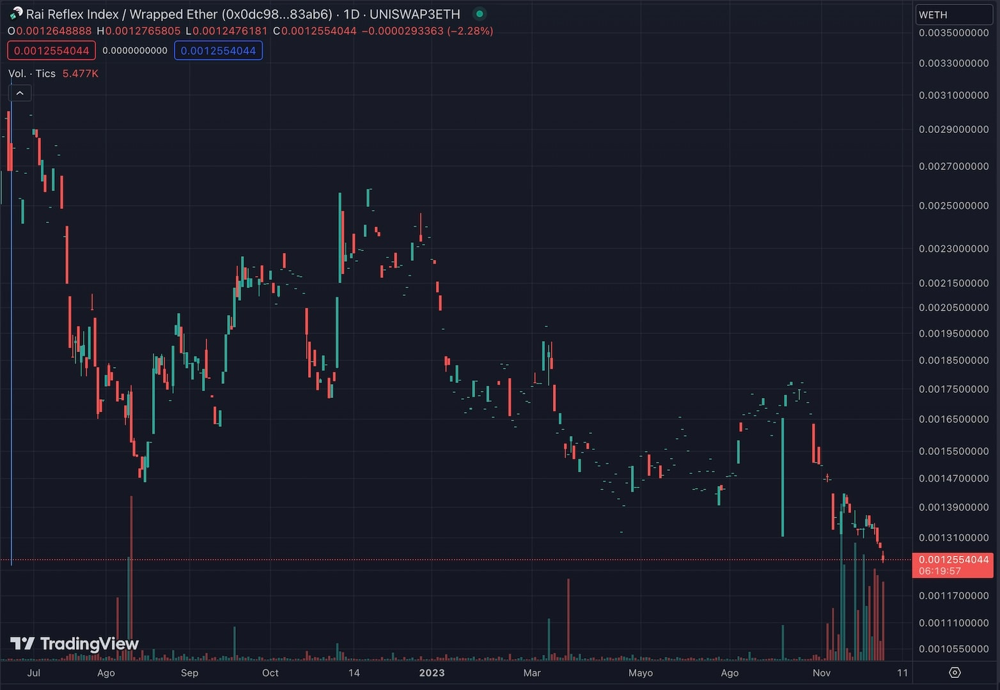
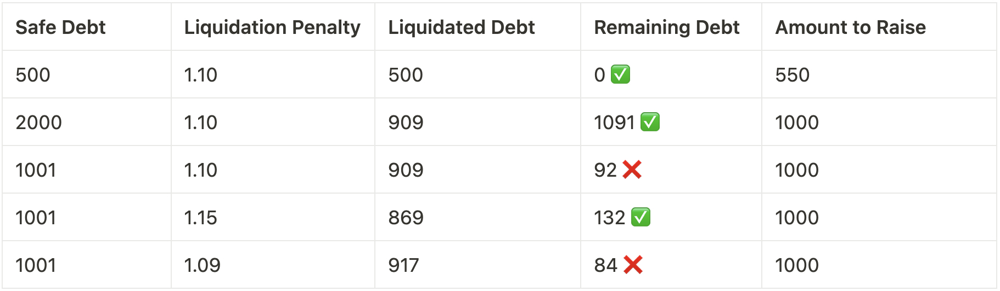
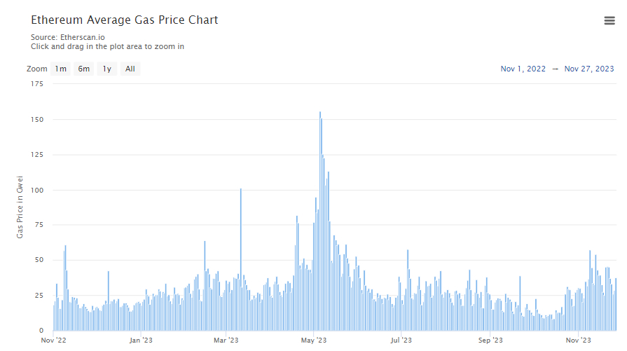

# Solved: A Zero-Day Exploit in GEB codebase
Authors: [wei3erHase](https://twitter.com/wei3erhase), [0xMono](https://twitter.com/0x_mono)


During our ["retreat,"](https://twitter.com/DeFi_Wonderland/status/1724121953512947965) on a night filled with wine, chess games, frisbee, and laughter, the break naturally turned into a work session. Working groups, motivated by enthusiasm (and a bit of alcohol), grouped to tackle some pending tasks. The HAI team was focused on the **last finding** of the 46 points raised in the two auditing processes. 

The finding named “**Liquidation DOS**” was categorized as **"minor severity"** in one of the two audit reports, in our opinion, due to the following:

- **Low probability of it happening:** Getting to the faulty reversal line is only achievable when a precise set of conditions are met, some dynamic over time
- **No immediate profit:** There was no possibility of quick profit by exploiting this bug
- **Simple solution through governance:** The problem could be solved by modifying some protocol parameters

A troubling question arose after fixing the bug in the HAI code base: "How is it possible that RAI, our role model (since we had copypasta GEB codebase with a few tweaks here and there), is not vulnerable to this same problem?" The absence of a clear answer was alarming: **It was!**

**"It's all laugh and fun until you find a bug live on mainnet, in an ungovernable protocol.”**

We decided to call it a night and return to work the next day. Yet not all the *[damajuanas](https://es.wikipedia.org/wiki/Damajuana)* in the world would make us forget about the seriousness of our discovery. Our first task was to confirm the reachability of the bug in RAI, and assess its possible effects on the protocol users, then report back to the Reflexer team to consider the available options and next steps. **A bomb had been activated.**

Applying the same evaluation criteria for RAI, this was a **critical** problem and of profound importance due to the ungovernable nature of RAI and its philosophy as a decentralized stablecoin:

- **Low probability of it happening:** Although low probability, an attacker can engineer an attack
- **No immediate profit:** Despite this, it could put the protocol in unhealthy debt and compromise the stability and recapitalization of the system
- **Simple solution through governance:** Difficult to implement due to protocol governance limitations

We’ve spotted a bug alive that, while not involving an immediate loss of funds (**funds are safu now!**), could leave the protocol vulnerable, possibly forcing a **governance shutdown**. Given the current state of RAI, it was conceivable that some actors, even at the risk of losing, would choose to exploit the flaw, causing more harm than good.

After communicating our findings, there was a period of silence while the Reflexer team verified the bug. We were determined to find a solution to avoid shutting down the protocol, especially before the launch of HAI, leaving the users with no safe harbour to maintain their collateral-backed debt positions. We did not want to hear the words **"Global Settlement"** coming out of our partners' mouths.

Once we resumed communication and became aware of the seriousness of the situation, we researched two possible solutions. The first, unfortunately, led us to an impasse. However, the second option was the most appropriate despite the technical challenges involved in the present ungovernance. This technical correction prevented us from being the cause of the closure of one of our ([and Vb!](https://x.com/kyoronut/status/1616955373851926533?s=20)) favorite stablecoins. 

The solution required an action by the DAO to authorize a contract and modify one of the few parameters that could still be modified. Then another question arose, **"How do we propose and vote on this action without publicly disclosing the bug?"**. The transactions necessary to execute the fix were to be discreetly sent along with the November FLX reward distribution, hoping no one would notice them.

A week later, the [innocent proposal](https://www.tally.xyz/gov/reflexer-ungovernor/proposal/39) was approved, and the fix went into effect. With RAI (the most affected protocol and with the highest TVL) out of danger, we disclosed the bug to the other team affected by this design flaw: TAI. As TAI had fewer restrictions in terms of governance, the solution was more straightforward, and the next day, [another innocent proposal](https://www.tally.xyz/gov/tai/proposal/25715647870826724893384566403969478394242704320930112822710906676227083258387?chart=1) was submitted to Tally to modify the necessary parameters and make the bug unreachable in their protocol.

This is the story of how Wonderland endangered and rescued two protocols with a combined TVL of over \$25 million from a 500+ days old bug.

# **Background**


In February 2021, the RAI system [introduced its **ungovernance token**](https://medium.com/reflexer-labs/rai-is-live-f151490b1b02) on the Ethereum Mainnet, later in 2022 Ethereum has transitioned from PoW to PoS. This shift opened new investment avenues for ETH users. However, RAI's reliance solely on ETH as collateral posed a dilemma for users, as staking ETH could yield returns instead of borrowing RAI. The governance contracts of RAI faced criticism for their limited flexibility, hindering parameter modifications and collateral additions. In response, the Wonderland and Reflexer teams collaborated in March 2023 to launch the "**[Let's get HAI](https://community.reflexer.finance/t/announcing-hai-a-multi-collateral-rai-fork-on-optimism/461)**" project on the Optimism Mainnet. This initiative aims to address challenges by introducing a multi-collateral iteration of RAI, enhancing its capabilities in the cryptocurrency ecosystem.

To develop HAI, we applied our [best practices](https://www.notion.so/Wonderland-s-guide-to-excellence-5b176394fdda496d839f3e4a3336e6ed?pvs=21), full test coverage, and gas efficiency changes using the RAI code base by refactoring the UI and SDK. During the development process we were able to discuss protocol design changes with the Reflexer team. These conversations were helped by the auditing processes we had as development progressed. It happened with the `LiquidationEngine/dusty-safe` reversion bug, in which we initially considered that the position (because of the dynamic variables involved in the calculation) could recover its liquidation state rather than being an attack vector until the audit pointed it out: **we had to take a stance on this flawed design**.

The bug was introduced at RAI on December 4, 2020 one month after [OZ audit](https://github.com/reflexer-labs/geb-audits/tree/master/open-zeppelin/core-contracts), under the title **["Do not allow dusty safes post liquidation"](https://github.com/reflexer-labs/geb/commit/63256de796ed0a01c54598cfc6751b0efe5b5201)** and was successfully executed on-chain on June 19, 2022. RAI has an open [bounty program (since November 2021 to present)](https://github.com/reflexer-labs/geb-audits/tree/master/quantstamp). HAI (GEB fork) has completed two audits this year, one of which identified the bug. In addition, other protocols that use HAI code, such as Open Dollar, have also been [audited](https://medium.com/code4rena/the-ones-in-the-arena-open-dollar-eca52da59dd5) (without noticing the design flaw). 

**Audits go beyond the mere identification of problems and failures. They are an essential phase in the design process, as they allow for the review of specific criteria and facilitate dialogue between the parties involved to implement significant changes in the protocol and avoid the worst-case scenario.**

# A window for exploit 🥷🏻




Since its introduction, this bug allowed users to make a leveraged long ETH-engineered position in the protocol that would be **non-liquidatable**, allowing the position to withstand any green candles, which would naturally have resulted in a liquidation of the user's investment. This approach is based on the expectation that, even if the debt at some point exceeds the collateral's value, the collateral will eventually recover its initial value. By holding a specific amount of well-calculated debt, the protocol would be unable to process these positions for recapitalization, i.e., it would not be able to liquidate them, thus generating a number of coins (debt) with insufficient backing.

> In this scenario, the attacker could have a considerable amount of ETH locked in the protocol, let’s say, valued at \$2000. In addition, the attacker would have the funds available to buy more ETH at \$1000 on the secondary market, loading his bags and then waiting for his position to recover and become profitable again. Once this happens, the attacker could repay his debt, earn a profit, and withdraw his initial investment.

# Design Context 🔍

SAFE positions are designed to maintain a minimum `debtFloor`representing the minimum amount of debt a SAFE with a specific `collateralType` must generate to be processable. If the debt is below this threshold, creating new SAFEs is impossible.

During the liquidation process, the `debtFloor` is considered to avoid the formation of positions below this threshold once liquidated. Unwanted positions, with small amounts of system coins, are called **dusty-safe**. The protocol implements several mechanisms to prevent their formation. The `LiquidationEngine` includes a [check](https://etherscan.io/address/0x4fFbAA89d648079Faafc7852dE49EA1dc92f9976#code#L365) that is reverted by `LiquidationEngine/dusty-safe`.

### **Limits in the liquidation process**

The `liquidationQuantity` limit is the maximum amount of debt that can be liquidated in a single auction. It is set such that an auction will be initiated, offering for sale `amountToSell` amount of collateral for an `amountToRaise`. The effect of the `liquidationPenalty`, which is the penalty applied to a SAFE when it is liquidated (extra amount of debt to be covered by auction), is explained below:

> For the sake of simplicity, let’s explain this scenario in a world where `debtFloor = 100`, and `liquidationQuantity = 1000`, using a `accumulatedRate = 1` (unaccounted), where a SAFE needs to be liquidated.



<!-- 
| SAFE Debt | Liquidation Penalty | Liquidated Debt | Remaining Debt | Amount to Raise |
| --- | --- | --- | --- | --- |
| 500 | 1.10 | 500 | 0 ✅ | 550 |
| 2000 | 1.10 | 909 | 1091 ✅ | 1000 |
| 1001 | 1.10 | 909 | 92 ❌ | 1000 |
| 1001 | 1.15 | 869 | 132 ✅ | 1000 |
| 1001 | 1.09 | 917 | 84 ❌ | 1000 | 
-->

*If the remaining value of the debt falls below* `debtFloor`*, the* `LiquidationEngine/dusty-safe` *check will reverse the transaction and the SAFE will not liquidate.*

# Reaching the Bug 🐞

As mentioned above, to prevent the creation of `dusty-safes` after liquidations, the `LiquidationEngine` implements a check and reverses with `LiquidationEngine/dusty-safe`. An attacker could exploit this check, creating one or several SAFEs with a precise amount of debt, which, in case of liquidation, causes the liquidation transaction to be reversed because the SAFE tries to reset below `debtFloor`; this is what was reported in the finding called **Liquidation DOS**:

- Debt is so significant that the liquidation gets limited to `liquidationQuantity`
- Debt falls between the range where `safeDebt - liquidationQuantity` is lesser than `debtFloor`

**This bug prevents the protocol from processing the SAFE, so it implies that:**

- `AccountingEngine` does not register the debt as a “protocol” bad debt.
- `AccountingEngine` cannot settle the debt with its surplus.
- The SAFE owner can repay the debt and remove the collateral.
- The SAFE owner may wait for the SAFE to regain its health.

**You can see a simulation of the bug [here](https://dashboard.tenderly.co/shared/fork/a5b1119a-6a0b-4289-8cf4-8a56642dd868/simulation/f6815a42-7f1b-4c63-9bca-a7eeed647c52).**

### The flawed safety check

```solidity
uint256 limitAdjustedDebt = minimum(
  safeDebt,
  multiply(
      minimum(
          collateralData.liquidationQuantity,
          subtract(onAuctionSystemCoinLimit, currentOnAuctionSystemCoins)
      ),
      WAD
  ) / accumulatedRate / collateralData.liquidationPenalty
);

/// ‼️ EXPLOITABLE REQUIREMENT
require(
    either(
        limitAdjustedDebt == safeDebt, // full-liquidation OR
        multiply(
            subtract(safeDebt,limitAdjustedDebt),
            accumulatedRate
        ) >= debtFloor
    ), "LiquidationEngine/dusty-safe");
```

### Formal verification

At the time of discovery, the protocol had the following parameters.

- `liquidationQuantity` : 90,000 RAD [90000e45]
- `liquidationPenalty` : 1.1 [1.1e18]
- `accumulatedRate` : 1.03 RAY [1.03e27]
- `debtFloor` 4,426.85 RAD [4426.85e45]

To liquidate a partial position (and not the whole debt), in order to avoid the `limitAdjustedDebt == debtAmount`, the `debtAmount` must be greater than:

```solidity
debtAmount >
    liquidationQuantity * WAD / accumulatedRate / liquidationPenalty

debtAmount >
    90000e45 * 1e18 / 1.03e27 / 1.1e18

debtAmount > 7.943e22

debtAmount > 79,435 WAD
```

### ****Inverse calc to reach revert****

```solidity
/// This condition would trigger dusty-safe error
debtAmount - limitAdjustedDebt < debtFloor / accumulatedRate

debtAmount < debtFloor / accumulatedRate + limitAdjustedDebt

/// replace limitAdjustedDebt
debtAmount <
debtFloor / accumulatedRate
    + liquidationQuantity * WAD / accumulatedRate / liquidationPenalty

/// replace for values

debtAmount <
    4426.85e45 / 1.03e27
    + 90000e45 * 1e18 / 1.03e27 / 1.1e18

debtAmount <
    4.29e21
    + 7.94e22

debtAmount < 8.369e22
debtAmount < 83,690 WAD
```

### Conclusion

Any SAFE with a debt higher than **79435** **RAD** and less than **83690 RAD** should fall in the **dusty-safe** error and, hence, be non-liquidatable.

# The Solution(s)


The bug was initially identified in the HAI codebase (a fork of GEB, which RAI and TAI use), which has yet to be launched in production. Our primary concern centered on the active protocols on production. Finding and implementing a solution to the problem was crucial before potential attackers could exploit it in RAI or TAI. Although all three protocols are based on the same code, each requires a specific solution. The most complex and risky case was RAI.

### For HAI & OpenDollar

- **Risk:** 0 (not yet deployed)
- We removed the reverting check `LiquidationEngine/dusty-safe`, and in the case the SAFE is left with a dusty amount after liquidation, [the contract will liquidate the whole position instead](https://github.com/hai-on-op/core/commit/496b787f90f3ad9c4df79f4c194806e8ca3880ec). **As suggested in Solidified report**.

**The fix is expected to be pulled from the OpenDollar protocol as well.**

### For TAI

- **Risk: [\$1.22M TVL, \$0.5M Debt](https://defillama.com/protocol/tai.money)**
- TAI has forked RAI entirely, with the same parameters, unless specified per `collateralType`, since they have broader collateral options. The `LiquidationEngine` parameters are the same, having a `liquidationQuantity` of `90.000e45`.

**We suggested the team, in order of quickest execution:**

- Increasing `liquidationQuantity` to `type(uint256).max / WAD` 
(always liquidate whole debt)
- Redeployment of the `LiquidationEngine` contract
(implement liquidation of dusty amounts)

### For RAI

- **[Risk: \$25,5M TVL, \$6.5M Debt](https://defillama.com/protocol/reflexer)**
- The case of RAI, as we have explained above, is much more complex due to its nature, and we will address it in detail below.

To address this critical bug, which was of urgent resolution for RAI, we proposed a solution in 2 parts. These solutions required obtaining permission to modify the `liquidationPenalty` in the `LiquidationEngineOverlay`. In addition, it was necessary to adjust the `gasPrice` parameter, which is the only governable parameter in the `debtFloor`calculation.

## Part 1: Cleaning the dust 💨

The difference between the minimum and maximum limits (ungoverned between 1.09 and 1.15) of `liquidationPenalty` is 6%; this solution attempts to liquidate the SAFE twice, with a 6% difference in either direction (up or down), to:

- liquidate a lesser amount of debt, so that the remaining debt is non-dusty
- liquidate a more significant amount of debt so that there is no remaining debt

> To configure `liquidationPenalty`,  authorization of the [`MinimalLiquidationEngineOverlay`](https://etherscan.io/address/0xa10C1e933C21315DfcaA8C8eDeDD032BD9b0Bccf#code) contract is required
> 

We created a new peripheral contract called [`DustyLiquidator`](https://gist.github.com/wei3erHase/77a9eb1f237aa050de97e98260cce9f3) that will execute modifications on `liquidationPenalty`, so that during the liquidation process, the following happens:

- Try to liquidate the SAFE in the current state
- Verify that the error is `LiquidationEngine/dusty-safe`
- Increase `liquidationPenalty` to maximum (*authorized*)
- Try to liquidate the SAFE with the maximum penalty
- Reduce `liquidationPenalty` to a minimum (*authorized*)
- Try to liquidate the SAFE with the minimum penalty
- Return penalty to the original value (*authorized*)

Given the possible variation on liquidatable debt, when we tweak `liquidationPenalty`, the solution works for **any given debt**, provided:

```solidity
debtFloor < 
    LIQUIDATION_QUANTITY * 1e18 / MIN_PENALTY 
    - LIQUIDATION_QUANTITY * 1e18 / MAX_PENALTY

debtFloor < 90,000e45 / 1.09 - 90,000e45 / 1.15

debtFloor < 4,307e45
```

At the time of discovery `debtFloor` was `4,426e45`, which means there was a window, in which no matter how the penalty is set, the SAFE can be engineered to fall within the non-liquidatable state.

## Part 2: Closing the window 🪟

The `debtFloor` is an ungoverned variable that is automatically set by the [`SingleDebtFloorAdjuster`](https://etherscan.io/address/0x2de894805e1c8F955a81219F1D32b902E919a855#code), reading the `gasPrice` from [`gasPriceOracle`](https://etherscan.io/address/0x6a8757d4eC5630EbF86A5DBBe2e65423195a47f4). The rationale behind this variable, is to ensure that the cost of processing a liquidation is lesser than the potential profit of executing it.

> The following formula is used to calculate it:
`debtFloor[USD] = gasPrice[gwei] * ethPrice[USD] * gasAmountForLiquidation`
> 

The only adjustable parameter is `gasPrice` which was set to `1100 gwei`. As this parameter is used to calculate the `debtFloor`, we proposed setting it to `550gwei` , reducing the minimum debt required to 2200 RAI or or USD 6000 (at the time of writing).

To determine the value of the `gasPrice` parameter, we based it on the fact that in the last year gas prices rarely averaged more than `100gwei`.



### Plan B: GlobalSettlement 🧨

One of the first options, if ungovernability restrictions prevent any parameters from being significantly modified, would be to trigger `GlobalSettlement`, a process that allows all system coin holders to redeem their coins for the underlying collateral. A UI for it was [already on development](https://community.reflexer.finance/t/global-settlement-ui/494) since August, as a precaution measurement.

In this scenario, if an attacker decides to exploit the protocol via the bug (which would require waiting for a drop ETH), they would risk the protocol being closed and their position being used to dilute any other bad debt the protocol may have.

During `GlobalSettlement`, this error does not affect how SAFEs are processed. Therefore, whenever the attacker's position is more vital than any other, their ETH will be used to "sanitize" the protocol's ledgers before the underlying collateral is released for redemption by RAI holders.

## Conclusions

Initially, we faced some uncertainties regarding a line of code related to verification that prevented the creation of **"dusty-safe"** positions. This concern arose because we believed that the position could be restored to good health over time, and we deferred its revision as the days went by. However, the subsequent audit pointed this out, giving us a new perspective and causing us to act accordingly. This finding prompted us to implement appropriate measures, thus facilitating the required modifications to the protocol.

We want to emphasize the importance of thorough and iterative audit processes. It underscores the need for a complete and collective understanding of the code by all stakeholders. Frequently, audits and competencies need to be deeper to detect errors that manifest under specific conditions, limited by the time available and the inherent complexity of the protocols, which represents a challenge in the learning curve.

Therefore, this scenario highlights the need for repeated testing, iteration, and a collective understanding of the code. These steps are essential to ensure the robustness and security of protocols in the decentralized finances domain.

# Who is Wonderland?


We're a group of developers, researchers, data scientists, investors, and executive leaders. We have something in common, though; we all love building cool sh*t.

Our mission is to discover, partner, and empower innovators to create open, permissionless, decentralized financial solutions. Our pledge is to stand by our partners, supporting them in every way we can.

We have partnered with some of the most successful and promising protocols in Web3 – including Aztec, Optimism, Connext, Safe, Keep3r, Reflexer, and Yearn – to find solutions to complex engineering challenges and help them reach their full potential.

We champion public good creation and believe in the invincibility of protocols backed by the right talent and incentives. We deeply believe in fostering a supportive community where collaboration trumps competition and building together is the norm, not the exception.

**DeFi sucks, but we are here to make it better.**
