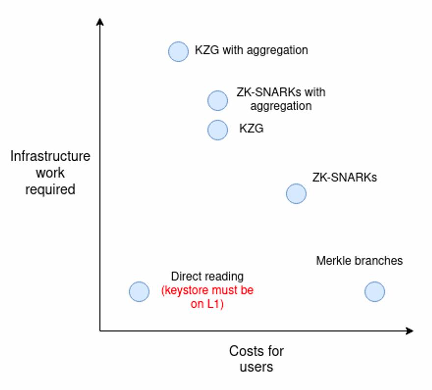

Authors: [Parti](https://twitter.com/0xParticle), [Skeletor Spaceman](https://twitter.com/Skeletor_Space)

## The EVM as the verifier

An inclusion proof is a computational operation that ensures, with a high confidence level, that a certain claim value belongs to a certain dataset represented by a commitment. A **storage proof** is an inclusion proof for a storage slot in an EVM contract. For a more detailed explanation on how these works, we recommend checking the following link:

[Storage Proofs](https://www.notion.so/Storage-Proofs-a1222fdca0024150917a4cdaab030af3?pvs=21)

Ethereum is a transparent and decentralized VM. As such, it is the ideal platform to act as a trustless verifier. If Ethereum is convinced, so should we. But what does it mean for Ethereum to be a verifier? Verification in a protocol is a series of deterministic steps conducted on a series of inputs. In particular, we can write a verification program in the bytecode of a Smart Contract.

Storage proofs are a powerful tool to minimize trust, and Ethereum provides an efficient design to prove them (Merkle Patricia Tries). Nonetheless, there hasn’t been much actual use. And that’s mainly because of the following reasons:

- State root availability:
  - In space: There is no way to query block header information cross-chain.
  - In time: EVMs only allow users to query block header information up to 256 blocks back
- Verification costs: Current verifier implementations consume approximately 200k in gas.

This report will analyze the current status of storage-proof solutions for increasing availability and costs.

## State root availability

### In space: Cross-chain state root

To execute the storage proof verification, it is necessary to have a reliable way to read the state root from the source chain in the destination chain. Light Client Proofs do not prove execution or storage but consensus (validator signatures) and use the beacon root (instead of the state root). These proofs assert that a specific state root *R* corresponds to a finalized block. In other words, a proof must prove that a particular state is valid and corresponds to the correct (finalized) fork choice. Unfortunately, the beacon root is currently not included in the execution layer, but [it's expected to](https://eips.ethereum.org/EIPS/eip-4788) be. So, how do we get this information to another chain?

One basic method to prove the consensus of chain A in the execution layer of chain B is to run an on-chain Light Client of chain A inside chain B. This is, of course, extremely expensive to run. To gain some intuition on why, consider that Ethereum consensus uses BLS signatures on a BLS12-381 curve, which are not included as a precompile in EVMs. Even if the Light Client verified the signatures of the [sync committee](https://github.com/ethereum/annotated-spec/blob/master/altair/sync-protocol.md#introduction) only, it is still prohibitory costly. Here is where zk comes into play.

[Succint](https://www.succinct.xyz/) developed a [contract](https://etherscan.io/address/0xaa1383ee33c81ef2274419dd5e0ea5cce4baf6cc#code) that verifies a zk-proof of consensus, where anyone can post a zkSNARK attesting that the sync committee has signed a block header. Their design also requires keeping track of the current sync committee, which is also done via a zkSNARK. The protocol is deployed on Ethereum and other chains, but the light client updates is operating [frequently only in Goerli](https://explorer.telepathy.xyz/). Each update in Ethereum costs [300k in gas](https://etherscan.io/tx/0x6d608c89eb97b249f40fc1db4306fe0b5af4d0dec3e1db1b8872b3ddf8c5af75). They enable light client proofs of Ethereum and Gnosis to Ethereum, Gnosis, Arbitrum, Avalanche, Binance, Optimism and Polygon (look [here](https://docs.telepathy.xyz/resources/contract-addresses) for the addresses).

[Bravis](https://brevis.network/) is using a similar [sync committee model](https://docs.brevis.network/zk-implementation/zk-light-client), but couldn’t find the light client contracts to figure out their gas cost.

Conversely, [Lagrange](https://www.lagrange.dev/) questions the security of a sync-committee-based light client (such as the one used by Succint), as they are exposed to [corruption risk](https://lagrange-labs.gitbook.io/lagrange-labs/overview/overview-of-existing-cross-chain-security-models). Moreover, they claim that it’s impossible to maintain a zkSNARK system that proves Casper Finality (Succint claims their SNARK include finality, so one of the two must be lying). To safely and efficiently update the finalized block header information, they use a node’s network restaked using Eigenlayer or other providers. This method also allows integrating other chains that don’t necessarily have Ethereum consensus. They are still on production.

[Herodotus](https://www.herodotus.dev/) is another key protocol here. They use native L1←→L2 message passing to synchronize block hashes between chains. The process is quite complex, involving multiple transactions over two contracts (full explanation can be found [here](https://docs.herodotus.dev/herodotus-docs/protocol-design/historical-block-hash-accumulator/initial-accumulation-event)). The total gas consumed is almost 4M ([here](https://etherscan.io/tx/0xbce801a066b3c522eb8817b352b08eaf5d04293c60e328500469495b42e60f19) and [here](https://etherscan.io/tx/0xa70b41ebf2243ca1825b5e873cb081dba93806703c7b5fe4e84c8078e86faa10)).

It’s worth noticing that L2s can post the `BLOCKHASH` from L1 directly on L2 by using a deposit function, as an arbitrary message. This needs to be actively supported, and none is doing it at the time of writing, as the cost would be pretty high (approximately $300k per rollup per year). Nonetheless, there is no need to update every single root: time batching could do wonders on saving unnecessary costs. Shared sequencer could also address this problem.

An alternative design would be to modify the client from the L2 and introduce an opcode/precompile that can access the `BLOCKHASH` directly without a deposit (leverage the fact that the sequencer is already reading the L1 state).

### In time: Historical state roots

The EVM allows contracts to fetch `BLOCKHASH` data up to 256 blocks back (less than 1 hour). This is not enough to make storage proofs of things like “who owned a certain ERC20 2 months ago?”, which could be used for a trustless airdrop distribution.

[Axiom](https://www.axiom.xyz/), [Relic](https://relicprotocol.com/) and [Herodotus](https://docs.herodotus.dev/herodotus-docs/historical-block-hash-accumulator) are working on storing these historical roots on-chain using zkSNARKs. They both have a [similar flow](https://docs.axiom.xyz/protocol-design/caching-block-hashes), where users update the latest roots with proof that a contract verifies. If the roots are valid, they get inserted into a Merkle Mountain Range. Herodotus also stores [the root cache into an MMR](https://docs.herodotus.dev/herodotus-docs/historical-block-hash-accumulator) but cross-chain using STARKs.

> ⛰️ Merkle Mountain Range:
> Once verified, the roots must be stored on-chain to run the other verifications (storage proofs, for instance). Nonetheless, keeping such a registry is expensive. There are several ways to optimize this point, with the most popular approach being Merkle Mountain Range structures, an efficiently updatable Merkle tree of roots (see [this explanation](https://docs.grin.mw/wiki/chain-state/merkle-mountain-range/), [Axiom implementation](https://docs.axiom.xyz/protocol-design/caching-block-hashes), the [Herodotus implementation in Cairo](https://github.com/HerodotusDev/cairo-mmr) and polytope [Solidity implementation](https://github.com/polytope-labs/solidity-merkle-trees/blob/main/src/MerkleMountainRange.sol)).

## Verification costs

As we mentioned, our goal is to prove the value of a certain storage value from a certain contract in a different chain. There are at least two ways to verify this on-chain:

- generate storage proof → verify it on-chain
- generate storage proof → generate zk proof for it → verify it on-chain

During the last few years, we have seen enormous technical advances in optimizing verification processes. The field of zk proofs has gained a lot of traction, in a big part due to their brief verification step. These proofs outsource the heavy computation to the prover to make verification as simple as possible.

This *succinctness* is particularly appealing when dealing with the EVM, as computation requires gas. In what follows, we will describe some possible approaches to dealing with storage proofs in this context.

In [this blog post](https://vitalik.eth.limo/general/2023/06/20/deeperdive.html), Vitalik compares five ways to tackle verification:

- Merkle proofs
- General-purpose zkSNARKs
- Special-purpose proofs (e.g. KZG)
- Verkle proofs
- Direct reading

Both zkSNARKs and KZG allow for proof aggregation, further reducing user costs.

In what follows, we will focus on the existing approaches to tackle this verification step. Even though storage proofs (with or without zk) are the most secure method, we will also consider other options in our analysis. For each, we will analyze the tradeoffs, possibilities, costs and state of development.

### Direct Merkle Proofs

MPT verification refers to contracts that can compute the whole storage proof from the Ethereum Merkle Patricia Trie on-chain. There are several working implementations of MPT verifiers written in Solidity. We recommend checking the [Lido](https://github.com/lidofinance/curve-merkle-oracle/blob/main/contracts/MerklePatriciaProofVerifier.sol) and [polytope](https://github.com/polytope-labs/solidity-merkle-trees/blob/main/test/MerklePatricia.t.sol) implementations. See [here](https://www.notion.so/Storage-Proofs-a1222fdca0024150917a4cdaab030af3?pvs=21) for more details.

It’s easy to generate proofs for any storage slot using the RPC providers’ [eth_getProof()](https://docs.infura.io/networks/ethereum/json-rpc-methods/eth_getproof) method. Storage-proof verification implementations require approximately 200k gas, which is considerable for Ethereum but not so much for L2s.

From the existing protocols we mentioned, [Relic](https://docs.relicprotocol.com/overview/comparison) and [Herodotus](https://www.herodotus.dev/) use direct MPT proofs against the verified roots. You can check out [Relic’s optimized Solidity library](https://github.com/Relic-Protocol/relic-contracts/blob/main/contracts/lib/MPT.sol) and Herodotus [Fact Registry](https://docs.herodotus.dev/herodotus-docs/architecture-overview/facts-registry) in [Starknet](https://goerli.voyager.online/contract/0x07c88f02f0757b25547af4d946445f92dbe3416116d46d7b2bd88bcfad65a06f). I also found this repo in Noir for Ethereum MPT verification: https://github.com/aragonzkresearch/noir-trie-proofs/

### General purpose zkProofs: zkSNARKs

SNARKs are argument systems that allow anyone to verify a program satisfaction claim in a non-interactive and succint way. This means that a prover can convince a verifier that they have an input that makes a computer program output a target value with a concise and easy-to-evaluate proof.

Storage proofs are only a particular use case for SNARKs, where a proof is crafted for the MPT storage proof computation. The idea here is to embed the MPT verification into a more succint SNARK.

There are many types of SNARK implementations, each with its corresponding costs. Some popular implementations in the EVM context are [Plonky2](https://github.com/0xPolygonZero/plonky2/blob/main/plonky2/plonky2.pdf) (which combines PLONK with FRI into a super efficient recursive SNARK) and [UltraPLONK](https://hackmd.io/Iuu9P7S5Sca0TCoYJ-sFdA) (more battle-tested, used by zkSync and Aztec, among others).

I strongly recommend [this resource](https://people.cs.georgetown.edu/jthaler/ProofsArgsAndZK.pdf) for anyone interested in a technical dive into the subject.

**Coprocessors**

[Coprocessors](https://crypto.mirror.xyz/BFqUfBNVZrqYau3Vz9WJ-BACw5FT3W30iUX3mPlKxtA) are instances that work like an off-chain VM extension that can execute heavy computation based on on-chain data. These coprocessors allow the outsource storage proofs (and other kinds of computation) from the chain and then submit a zk proof that is cheaper to verify. Notice the definition of a coprocessor is [quite vague](https://dba.xyz/do-rollups-inherit-security/), which has lead to [some discussions](https://twitter.com/jon_charb/status/1698587623843823649). Storage proofs are just a [particular use case for coprocessors](https://x.com/p_e/status/1715004957576004066?s=20) but also the most common use case.

[Axiom](https://www.axiom.xyz/) is the most popular player in this design space, specially tailored for historical proofs inside Ethereum. They have a [library](https://github.com/axiom-crypto/axiom-eth/) for creating custom circuits for storage proofs. They use Halo2 arithmetization (a method to convert programs to arithmetic circuits) and KZG polynomial commitments. Users must offer a reward to initiate a query, similar to our module design. They recently [announced their v2](https://x.com/axiom_xyz/status/1729574062031331539?s=20), which also includes transaction and receipts proofs.

At the time of writing, they have deployed their contracts on mainnet only. A potential integration would require deploying the contracts on the different networks, which is not that easy to do, as verification requires query access to the state roots cache ([MMR implementation](https://docs.axiom.xyz/protocol-design/caching-block-hashes)).

Also, note that the current implementation consumes above [500k gas per query answer](https://etherscan.io/address/0xd617ab7f787adf64c2b5b920c251ea10cd35a952), even more than the current MPT implementations. Axiom has, of course, a lot of additional benefits, such as allowing queries to go back in time.

Gas comparison for different proofs. Image taken from [Relic’s documentation](https://docs.relicprotocol.com/overview/comparison):
.](../img/blog-posts/liveness-2-and-beyond/table-1.jpg)

[Brevis](https://brevis.network/) also does zk [storage proofs](https://docs.brevis.network/zk-implementation/slot-value-proof), but using Groth16 based circuits. It can also be used to prove claims using the [Receipts](https://docs.brevis.network/zk-implementation/receipt-proof) and [Transaction](https://docs.brevis.network/zk-implementation/transaction-proof) Tries. They have a [working demo](https://demo.brevis.network/) which allows to generate storage proofs for Ethereum and then submit the proof to BSC chain (check verifier contract [here](https://testnet.bscscan.com/address/0xc2307a0596a69f1f4c55d2f30df32eb9ef513980#code)).

[Herodotus](https://docs.herodotus.dev/herodotus-docs/developers/storage-proofs) has its own implementation for storage proofs. It’s already deployed and running, but it’s extremely expensive to verify ([over 5M gas](https://etherscan.io/tx/0x361c9b614c4247a22dd8404bccf54273c4ad4e77e876481b53f5e35d11c2f93c) at the time of writing).

[RISC Zero](https://www.risczero.com/) allows users to verify general computation written in [Rust](https://dev.risczero.com/zkvm) using [STARKs](https://dev.risczero.com/proof-system/stark-by-hand) and their [Bonsai](https://dev.risczero.com/bonsai) proving system. They also built [Zeth](https://www.risczero.com/news/zeth-release), their own block and state prover, aka a type 0 zk-rollup. In theory, the gas costs are [scalable](https://www.risczero.com/news/on-chain-verification) (around 200k in callback and 30k in request).

On a similar line, [fhEVM](https://www.zama.ai/fhevm) aims to create a coprocessor for private smart contract functionalities. RISC Zero and fhEVM are still in an early stage and not production-ready.

**Batching proofs: zk MapReduce & Recproofs**

The goal is to have a proof construction method optimized for generating large-scale batch storage proofs.

zkMapReduce allows anyone to prove they’ve performed specific computations on a dataset without revealing the dataset itself or the intermediate steps. The proof has to prove the existence of the underlying data (a storage proof) and the result of a computation on it. Proofs use vector commitment schemes, making them suitable for proving distributed computation, such as SQL or MapReduce.

This method allows the merging of storage proofs from different chains into a single proof, simultaneously acting as a coprocessor for multiple chains. This is [what Lagrange uses](https://lagrange-labs.gitbook.io/lagrange-labs/zk-big-data/overview-of-the-zk-big-data-stack) to act as an [n-1 bridge](https://lagrange-labs.gitbook.io/lagrange-labs/overview/what-is-the-lagrange-protocol). The bad news is that updating existing proofs is expensive, which Lagrange’s Recproofs aim to solve.

[Recproofs](https://uploads-ssl.webflow.com/6460ebf2b6ff254688bebf1c/64e4dd54d9198fde8d58ef44_main.pdf) are a particular Merkle-tree-based vector commitment scheme that allows proof batching for a group of leaves using recursive SNARKs. This is particularly useful for large datasets and allows efficient proof updates for MapReduce systems. To achieve this, they use folding schemes, where a set of proofs gets compacted into a single proof of proofs. What’s important to know is that this proof is O(log n) with n the number of underlying proofs. We could expect Lagrange to implement Recproofs to improve their system’s proof update process.

Lagrange is yet to be operating, so we still have yet to determine what the gas cost for this system will be for the users. Due to batching, we expect systems like this to become more relevant with the number of storage proofs.

**Other approaches**

[HyperOracle](https://www.hyperoracle.io/) defines itself as programable zkOracle. It will allow users to query any information on-chain, including state or storage proofs from Ethereum, using zk-verified methods. These proofs can also work for historical data (beyond the 256 blocks). The product is still in construction, and we could not find details on the zk tools being used, nor expected gas cost or latency.

### Specific purpose zkProofs: KZG

KZG allow the construction of efficiently updatable storage proofs. Dankrad does a great job of summarizing KZG in [this post](https://dankradfeist.de/ethereum/2020/06/16/kate-polynomial-commitments.html). The basic intuition works as follows:

- Given a dataset $\{a_1,\dots,a_n\}$ , it’s possible to create a polynomial $P$ such that interpolates to the dataset at the powers of the root of unity $w\ni w^N=1$ in mod $N$. The interpolation expects that $P(w)=a_1, P(w^2)=a_2,\dots P(w^N)=a_n$, and can be done using Lagrange.
- A commitment to $P$ is an elliptic curve point defined as $com(P)=P_0 * G + P_1 * S_1 + \dots + P_k * S_k$ with $G$ the generator point of the curve, $P_i$ the i-th degree coefficient of the polynomial and $S_i$ the i-th point of the trusted setup.
- To create a proof for the claim $P(z)=a$, the prover must generate a polynomial $Q=\frac{P-a}{x-z}$ , and then commit to it $com(Q)$. This polynomial is well defined if and only if $P(z)=a$.
- Verifier checks the equation $Q * (x-z)=P-a$ in the elliptic curve using pairings $e$: $e(com(Q),com(x-z)) ?= e(com(P)-com(a),com(1))$

**Efficient updates**

As we mentioned, an attractive property of KZG is that proofs can be efficiently updated: if a specific value $a_i$ wants to $a_i^*$, then the old commitment to $P$ can be updated to a commitment to $P^*$ as follows: $com(P^*)=com(P)+(a_i^*-a_i) * com(L_i)$ with $L_i$ the Lagrange polynomial that equals 1 at $w^i$ and 0 on $w^j\;\forall j\neq i$. Notice $com(L_i)$ can be precomputed by the prover ($N$ commitments). The verifier, on the other hand, will not store the commitments but can receive a KZG commitment or a Merkle proof for the set to prove correctness. Hence, this protocol enables efficient updates, which would be ideal for our concrete application.

Additionally, two KZG proofs can be merged into a single one, which would simplify our current two step verification contracts into a single one.

Implementations of KZG in Solidity are still in the [experimental stage](https://github.com/topics/kzg-commitment). Most implementations focus on its application for [EIP-4844](https://www.eip4844.com/) rather than for storage proofs. Also, KZG is worth it if batching can be done, which will probably not happen for the PoC.

### Verkle Proofs

[Verkle trees](https://vitalik.ca/general/2021/06/18/verkle.html) are improvements over Merkle Patricia Tries for storing key-value mappings. It uses stacked Polynomial or [Inner Product](https://vitalik.eth.limo/general/2021/11/05/halo.html#background-how-do-inner-product-arguments-work) commitments. These structures are [likely to be incorporated into Ethereum as the new state tree](https://notes.ethereum.org/@vbuterin/verkle_tree_eip).

A SNARK can be generated for Verkle tree inclusion proofs, resulting in lower prover cost than current Merkle structures. However, implementations are still far away to consider.

### Direct Reading

It is possible to enable [static calls from L2 contracts to L1 contracts](https://ethresear.ch/t/cross-layer-communication-trivially-provable-and-efficient-read-access-to-the-parent-chain/15396). This would require a special opcode or precompile in the L2. Remember that sequencers are already aware of the L1 state, as they have to track the rollup contract, so it’s mostly an implementation challenge.

Optimism has recently opened a [request for a proof of concept](https://github.com/ethereum-optimism/ecosystem-contributions/issues/76) on this line.

### Further Optimizations

**Consensus**

Some protocols can answer state queries using consensus instead of cryptographic verification. This method introduces a considerable amount of trust but also reduces the cost of operations and latency.

[Succint](https://www.succinct.xyz/) is [following this design choice](https://docs.telepathy.xyz/state-queries/introduction) by leveraging its [attestation network](https://docs.telepathy.xyz/state-queries/succinct-attestation-network). The product was still not ready at the time of writing, so we could not find precise information on the gas costs. We did, however, find this sentence in their [documentation](https://docs.telepathy.xyz/state-queries/succinct-attestation-network):

> Many developers rely on oracles to power liquidations or other very latency sensitive parts of their protocol. These developers want the lowest-possible latency for their oracle requests. While there have been tremendous leaps in zk proof technology, the proof generation time is still ultimately too slow for many use-cases. Also, verifying a zk proof is cheap, however for _minimized_ gas costs, verifying signatures from a network is even cheaper (generally 240k gas vs. 30k gas if our network has 15 validators). Thus many developers prefer a committee based approach for minimal latency and minimal gas costs.

We will advise against this for now, even though it could reduce enormously cost and latency because we consider it is not worth the additional security risks.

**Optimistic layer**

A middle ground between consensus methods and full verification is to use an optimistic system where users can request and receive a state update. This system should include a verification method with a full procedure (direct MPT or zk) in case of a dispute. Such a mechanism aims to lower the gas cost of storage proofs with only a minor increase in trust (1-N will dispute).

An optimistic layer has an additional price to pay, which is latency. The mechanism requires a long time window to ensure agents have time to dispute. The longer the time window, the safer the optimistic system, but the higher the request latency.

**_Shared sequencers_**

Shared sequencing is one of the hottest topics in web3 at the moment. As sequencers usually play a huge role in communication between chains, it is unsurprising that a shared sequencer can optimize communication by implementing shared proofs.

This design would have a similar end goal to what Lagrange does with N-1 communication but using simpler aggregated proofs. These [thoughts](https://hackmd.io/@kalmanlajko/ByE28sYfs) are still early and being [actively discussed](https://www.umbraresearch.xyz/writings/shared-validity-sequencing).

This approach is currently out of scope from this project but could be considered if shared sequencer become a thing.

## Takeaways

We will now summarize and add some comments on the status of storage proofs.

- State root availability: There is no doubt Ethereum’s state root will be the most popular among the EVMs, and hence the most widely available.
  Moreover, picking Ethereum as the source chain and rollups as destination chains also means verification costs will be paid on cheaper networks.
  This should have a significant impact on the design of systems requiring storage proofs, with [Spoke-Hub](https://en.wikipedia.org/wiki/Spoke%E2%80%93hub_distribution_paradigm) architectures becoming more widespread.

The only solution currently posting the root and with a relatively low verification cost is Succint (300k gas average per update). Succint only bridges the state root to [Optimism](https://optimistic.etherscan.io/tx/0x107b36c2418ee56c46f1d380c370fb4f1a6ae40eade18072577d418e8ab60011), Arbitrum, Polygon, Gnosis, BSC and Avalanche. At the moment, their [operators](https://docs.telepathy.xyz/telepathy-protocol/actors) charge no fee for the update, but an on-demand integration would probably require some kind of incentive.

An alternative way of addressing this issue is using a bridge, which usually costs around 200k for these message passing. [Connext](https://bridge.connext.network/) has the upper hand regarding message security among the top candidates, as they implement Merkle verification methods on top of AMBs, instead of signature aggregations like the vast majority.

- Improve proof efficiency: One main point we analyzed was the proof cost. We noticed that MPT verifiers are cheaper than existing ZK single-proof implementations. There are two main approaches to reducing verification costs for the latter:
  - Updatable proofs: as we mentioned, MPT proofs need to be recomputed and rechecked from scratch every time something changes, and it doesn’t matter if it’s just one or one million changes. KZG and Recproofs are two protocols that address this issue. In particular, KZG is more straightforward to implement and probably more efficient for the number of proofs we expect, while Recproofs shines for larger datasets.
  - Proof batching: some verification methods allow batching of several proofs into one. This is possible with KZG and SNARK using different methods (e.g. folding scheme).
    Currently, there are no efficient implementations for either approach in the context of storage proofs. It's out of our scope of this work to develop one.
    These proofs usually have a large cost for single executions and then scale slowly. This means that, for single proofs, MPT verification will stay the most competitive, but there is a number of proofs at which ZK methods become more efficient.
- Optimistic layer: One easy way to reduce verification costs with only a small trust increase is using optimistic oracles. The idea here is to trust a bonded proposer with the correct updated information and then let anyone (bonded agent) dispute the answer. In a dispute, conflict resolution involves running the complete verification. In that case, the gas cost of verification would be deducted from the losing side’s bond.

The optimistic layer would allow the exchange of two MPT verifications, which are close to 200K gas each, for a request and update, which will be cheaper. Moreover, optimistic systems can update several users simultaneously (batching), with practically the same gas cost.

A negative factor introduced by optimistic layers is latency, as a safe system requires time for disputers to act. Latency could be a problem for the module in the case of heavy activity, which may not be the case at the beginning. What’s more, lowering the gas cost of the process can bootstrap users in the same way liquidity incentives do. We could expect a first optimization to use optimistic layers and eventually move to more advanced KZG/SNARK systems (lower latency) with aggregation when the number of users justifies the total cost.

There are currently no optimistic oracles that enable custom resolution methods. We, at Wonderland, are actively developing Prophet together with Optimism, which will be a framework that enables this use case. Information on the gas cost will be available soon.

It’s also possible to create a custom dispute system for this particular project, which could be more gas-efficient. The issue with that would be to bootstrap activity from bonded actors. That’s why Prophet could be a better fit, even if it means using a bit more gas.

For the PoC, we expect to work on sidechains only, meaning the total gas cost of MPT verification will not be prohibitive. Similarly to the zk-methods, an optimistic layer would make much more sense for verifying in Ethereum (Home Chains different than mainnet). Implementing said layer would be a manageable experiment for a future Home chain generalization at this point.

- Potential ecosystem optimization: beyond improving verification methods, the ecosystem is currently discussing several architecture changes that might simplify the • problem’s scope.
  - Rollups might make the Ethereum state root available: many protocols will be interested in having state root availability for different applications, so it should not be surprising to see rollups or AMBs making this value globally available. This would allow us to reduce the costs further (or increase the frequency), as payments could be batched with different services.
  - Rollups might enable direct reading eventually, which would simplify the whole verification. Direct reading would be an enormous factor in favour of keeping Ethereum as the Home Chain, but would still require dedicated solutions for non-L2 chains.
  - Shared sequencing or data availability layers can act as a way of sharing Home chain verification among several chains, reducing the cost for each even further.
  - If implemented, Verkle tree structures will completely change (for the better) the whole verification algorithm. The module, together with many other products using storage proofs, would require a major update.

