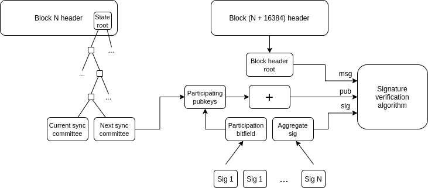

Authors: [Enti](https://twitter.com/entigdd), [Parti](https://twitter.com/0xParticle)

## TLDR

> 💡 In this article, we explore the trust assumptions behind on-chain light clients in Ethereum for cross-chain communication and analyze whether they are a sound solution.

## The problem

Web3 is about minimizing trust: do not trust servers, centralized entities, or proprietary code. Safe interoperability between programs is an often overlooked but powerful result of minimizing trust, allowing developers to:

- Read storage from other contracts.
- Execute functions on external contracts.
- Prove claims about the state of the EVM, transactions, and receipts against the block header information.
- And much more.

However, this is worthless if the network is congested and unusable. Scaling solutions offload some execution from layer 1 but introduce a significant issue: fragmentation. This is most commonly thought for liquidity, but that’s only a subset of problems from state fragmentation.

Bridges come as a patch to mitigate fragmentation. For rollups, trust assumptions overlap the chain itself because the sequencer handles message passing and inclusion. For separate chains, bridges often rely on multisig mechanisms ([and we](https://rekt.news/nomad-rekt/) [all](https://rekt.news/bnb-bridge-rekt/) [know](https://rekt.news/orbit-bridge-rekt/) [how](https://rekt.news/socket-rekt/) [it](https://rekt.news/wormhole-rekt/) [ends](https://rekt.news/ronin-rekt/)).


No matter how secure the connection is, these solutions fall short of replicating the same-chain experience. There are ongoing discussions about implementing direct reading and calls in rollups, but the if and how remain uncertain.

So, what can we do? What is the trust-minimized solution to cross-chain?

### State proofs: an incomplete path

In a [previous post](https://defi.sucks/insights/current-state-of-storage-proofs), we went deep on state proofs; they allow anyone to verify a claim about a VM’s state from a single cryptographic commitment—the state root. This allows for arbitrary claims about another chain’s state or transactions. Moreover, the same state root is sufficient for every cross-chain application, making it a more scalable solution than passing individual messages around.

As long as we trust the cryptographic primitives, falsifying a state proof is impossible. But this is only partially true: what if the root is not the right one? Who or how is the root uploaded? This has historically been the most painful point for cross-chain communication.

One solution could involve bridging state roots through AMBs or canonical bridges, maintaining the security level of the connected chain. Yet, this approach is limited:

- Only a small set of chains are connected to Ethereum via an AMB.
- There is no finality information on the execution layer, requiring an additional oracle and trust.

To some extent, other ecosystems have overcome those limitations using light clients, and Ethereum has them now.

But what are they, how do they work, and can we actually trust them?

## Ethereum light clients

Satoshi introduced Simple Payment Verification (SPV) in the [Bitcoin Whitepaper](https://bitcoin.org/bitcoin.pdf) to verify the state of a chain with few resources and as many security guarantees as possible. SPV is deemed the predecessor to what we know today as light clients. They come in different forms depending on the architecture and needs of the blockchain. In the case of Ethereum, the Altair hard fork in Oct. 2021 introduced this client type.

Unlike full nodes, light clients are not required to download the entire blockchain. Instead, they read beacon chain information and then run a verification algorithm to accept or reject the updates.

This makes light clients a perfect fit for various use cases. For example, a wallet can run a client in-device to fetch data and send transactions without relying on a trusted 3rd party like an RPC provider.

As mentioned above, cross-chain infrastructure is one of the most promising use cases. To do so in a trustless way, it’s necessary to run a chain A light client inside chain B, and vice versa. However, it’s not as simple as it sounds. To understand why, let’s look at Light Clients in further detail.


> 💡 How can light clients help here?

> It’s pretty straightforward to prove arbitrary information about a blockchain given its state root; what’s hard is getting the state root from another blockchain securely. Light clients seem to be the solution as they are first-class citizens with access to that state root, but without requiring to store and update the state as full or archive clients do.

### The sync committee

Ethereum currently has about [900,000 validators](https://stakers.info/). If a light client had to track and validate their signatures, it wouldn’t be that light anymore. Conversely, the protocol relies on a Sync Committee to talk with light clients.

This committee consists of 512 randomly selected validators that, on top of their regular duties, are asked to sign the new head of the chain at each slot for 256 epochs (~27 hours), after which the following committee begins their duties. To simplify verification (we’ll talk more about that in a second), the committee is also stored in the beacon state.

Choosing the committee's size was an effort to balance the low computation required by light clients and the need to provide data securely. At first, the suggestion was to have the [size be 256 to prevent a known attack on RANDAO](https://github.com/ethereum/consensus-specs/pull/2130#issuecomment-726032581), and then it was bumped to 512 as it improved security, plus the computation increase was marginal.

With that sample size, the assumption is that the committee accurately represents the validator set. So, as long as 2/3 of the network is honest, the committee will likely be reliable.

### Incentives

The sync committee does not work for free, though. Part of the ether issuance goes to the successful participation of its members in every slot. Taking the current 900,000 validators and assuming all have an effective balance of 32 ETH, we can calculate the rewards of the committee as follows:

- The [base reward per increment](https://eth2book.info/capella/part2/incentives/issuance/#the-base-reward-per-increment) $b$ is $\frac{1,000,000,000\times 64}{\sqrt{32,000,000,000\times 900,000}} \simeq  380$ Gwei
- Value of a single committee contribution in a slot $C_s$ is $\frac{2}{32\times 512\times 64}900,000\times 32b \simeq 21,000$ Gwei
- Therefore, the maximum amount of rewards each member receives per committee period amounts to $C_s\times 32\times 256 \simeq 0.17$ ether

There are penalties for members missing or submitting incorrect signatures equal to $C_s$ plus missed rewards. Hence, the total penalty is $2\times C_s$ (half slashed, half non-earned rewards). Complete issuance, rewards, and penalties calculations can be found in [Ben’s](https://twitter.com/benjaminion_xyz/) [Upgrading Ethereum](https://eth2book.info/capella/preface/) book.

> 😅 Rewards for the committee members are relatively large, at least when compared to attestation rewards. However, participation is very rare; on average, a validator takes 67 months (5 years and 7 months) to be selected as part of the sync committee with the current set of 900,000 validators. This is distorted by large staking pools, which may get elected more often.

### What does the light client verify?



A simplified diagram of how a light client works—[Sync Protocol](https://github.com/ethereum/annotated-spec/blob/master/altair/sync-protocol.md) (Altair Annotated Specs)

The light client sees the following `LightClientUpdate` object from the network:

```jsx
class LightClientUpdate(Container):
    # Update beacon block header
    header: BeaconBlockHeader
    # Next sync committee corresponding to the header
    next_sync_committee: SyncCommittee
    next_sync_committee_branch: Vector[Bytes32, floorlog2(NEXT_SYNC_COMMITTEE_INDEX)]
    # Finality proof for the update header
    finality_header: BeaconBlockHeader
    finality_branch: Vector[Bytes32, floorlog2(FINALIZED_ROOT_INDEX)]
    # Sync committee aggregate signature
    sync_committee_bits: Bitvector[SYNC_COMMITTEE_SIZE]
    sync_committee_signature: BLSSignature
    # Fork version for the aggregate signature
    fork_version: Version
```

But it does not simply trust the update, the client verifies that

1. **Sync committee correctness:** the sync committee members stored in the `header` are correct, by checking against the `next_sync_committee` from the previous block
2. **Finality correctness:** the `finality_header` corresponds to the checkpoint stored in the `header`
3. **Header correctness:** the `header` (Beacon Block header) was signed by the checked sync committee.

**How do they do this?**

Light clients can use the Beacon Block header they receive to check that the new `next_sync_committee` and `finality_header` are correct. To see how is this possible, we will open the Beacon Block header and see what’s inside:

- **[BeaconBlockHeader](https://eth2book.info/capella/part3/containers/dependencies/#beaconblockheader)** object (that can be found in the `LightClientUpdate` ) is the header of the **[BeaconBlock](https://eth2book.info/capella/part3/containers/blocks/#beaconblock)** .
- The `BeaconBlock` object contains a `state_root` corresponding to the **[BeaconState](https://eth2book.info/capella/part3/containers/state/#beacon-state)** .
- The `BeaconState` contains a lot of information, including:
  - `current_sync_committee`: information about the current sync committee, which can be proven against the `next_sync_committee` from the previous block to prove Sync Committee correctness.
  - `next_sync_committee`: has information about the next sync committee and can be proven using a merkle verification with the `next_sync_committee_branch` path inside the `LightClientUpdate` to prove Sync Committee correctness on the next block.
  - `finalized_checkpoint`: which is a [Checkpoint](https://eth2book.info/capella/part3/containers/dependencies/#checkpoint) that tracks the blocks from a finalized epoch. It’s possible to create a merkle proof for a finalized header using the path in `finality_branch` to prove Finality correctness.
  - `latest_execution_payload_header`: an [ExecutionPayload](https://eth2book.info/capella/part3/containers/execution/#executionpayload) object, that contains information about the Execution layer, including the `state_root` and the `block_hash` (which also contains the `state_root` ). This is the missing piece of the puzzle that connects the Beacon chain to the Execution layer.

And this is how light clients are able to, block by block, verify sync committee, state root from the execution layer, and finality information.

**How do light clients prove Header correctness?**

The validity of the obtained header is checked using a signature verification algorithm. In particular, light clients use BLS (Boneh-Lynn-Shacham) for sync committee signature aggregation. BLS is used over ECDSA because it scales much better with the number of verifications, even if every single verification is slower. In particular, with BLS, any number of signatures on the same message can be verified with a constant time.

The Beacon chain uses the [BLS12-381](https://hackmd.io/@benjaminion/bls12-381) elliptic curve, that allows for [pairing](https://medium.com/@VitalikButerin/exploring-elliptic-curve-pairings-c73c1864e627). The inputs of BLS are:

- The list of public keys from the sync committee members.
- The aggregated signature.
- The message (Block Header root).

If the light client receives invalid block roots and matching signatures from the committee, the verification algorithm will accept the root (and hence the Header) as valid.


For more details, check the advanced explanation [here](https://defi-wonderland.notion.site/How-does-BLS-work-2acfd094544c4b8dbc6a1fd30cef1ccc?pvs=4)

### Going onchain: say hello to ZK

To create trustless cross-chain infrastructure out of light clients, it’s necessary to make them run on-chain. These programs are supposed to replicate the signature verification scheme on a smart contract.

The problem is that there isn’t a pre-compile nor efficient implementation in the EVM for the BLS12-381 curve, meaning the gas cost of verifying would be prohibitory.

Here is where ZK comes into play: we can create succinct arguments of knowledge (SNARKs) proving the correct execution of complex offchain computation.

> Quoting from a previous post: https://defi.sucks/insights/current-state-of-storage-proofs
>
> [Succinct](https://www.succinct.xyz/) developed a [contract](https://etherscan.io/address/0xaa1383ee33c81ef2274419dd5e0ea5cce4baf6cc#code) that verifies a zk-proof of consensus, where anyone can post a zkSNARK attesting that the sync committee has signed a block header. Their design also requires keeping track of the current sync committee, which is done via a zkSNARK. The protocol is deployed on Ethereum and other chains, but the light client updates are operating [frequently only on Goerli](https://explorer.telepathy.xyz/). Each update in Ethereum costs [300k in gas](https://etherscan.io/tx/0x6d608c89eb97b249f40fc1db4306fe0b5af4d0dec3e1db1b8872b3ddf8c5af75). They enable light client proofs of Ethereum and Gnosis to Ethereum, Gnosis, Arbitrum, Avalanche, Binance, Optimism and Polygon (find the address [here](https://docs.telepathy.xyz/resources/contract-addresses)).
>
> [Bravis](https://brevis.network/) is using a similar [sync committee model](https://docs.brevis.network/zk-implementation/zk-light-client).

## Beware of what you trust, anon

> _Peering down the rabbit's hole, where wonders unfold,
> Magic dances, bright and clear, but caution is gold.
> Should I leap, or should I wait, in this glimpse so small?
> A world so inviting, yet the leap feels so tall.
> 🕳️🐇_


Up to this point, onchain light clients seem to be a trust-minimized solution to the cross-chain problem, but we already know there’s no such thing as a free lunch. The security of a protocol is as strong as its weakest link, and the Ethereum Sync Committee design [has been criticized](https://prestwich.substack.com/p/altair) for its unconstrained behavior.

We'll now explore the trust assumptions inherent to light clients:

- Data correctness
- Finality of source chain

Afterward, we'll examine further assumptions specific to onchain light clients:

- Incentives sustainability
- Reliability of ZK Proofs

### Can we trust the data?

While BLS signature verification is reliable, it’s not the whole picture. It is technically possible to fool the system into accepting an invalid Beacon block root if the inputs get modified accordingly. Remember the inputs are:

- Sync committee members' public keys
- The aggregated signature
- The message (root)

If the light client receives invalid block roots and matching signatures from the committee, the verification algorithm will accept the root as valid. Inputs can be fooled in two ways:

- **Provider corruption:** Light clients mostly rely on [libp2p](https://github.com/ethereum/consensus-specs/blob/dev/specs/capella/light-client/p2p-interface.md) and API REST for updates. The latter, being centralized, is more susceptible to corruption, potentially misleading even the sync committe’s public keys. Corrupting a P2P-fed light client is orders of magnitude more complex, but it’s theoretically possible.
- **Corrupted sync committee:** even if the provider is honest, the committee [can attest to an invalid root](https://prestwich.substack.com/p/altair), or can stop sending signatures at all, which would cause the light client to take updates that would otherwise be clarified as low-security.

At the time of writing, sync committee penalties are low, less than $2\times 0.2$ ether for members for the whole period (half slashed, half reward not collected). Furthermore, as the sync committee only has 512 members and $2/3$ are necessary to convince a light client, $0.5\times 512\times 2/3 \simeq 136$ ether might be enough incentive to bribe and make the committee sign an invalid root. Even if they were slashed the whole stake of 32 ether, $32\times 512\times 2/3\simeq$11k ETH $\simeq 22M$ USD (with ETH priced at 2K USD).

While most node clients bootstrap from a peer list to start the data exchange, Ethereum light clients are early stage and often depend on trusted third parties like RPCs. A misbehaving data provider threatens on-chain clients more than committee behavior.

Implementations like [Helios](https://github.com/a16z/helios) have made decent progress by including consensus and execution clients with a different RPC for each. This approach enables verifications against the information each provides, so the user no longer needs to trust any of them.

> 🙀 The sword of Damocles

> One key takeaway here is that an attack to any system becomes feasible when the potential profit from corrupting it outpaces the cost of an attack. In this case, light-client based bridges are only adding potential profit without increasing the cost of corrupting the committee, placing a huge scalability upperbound on these solutions.

Potential improvements include:

- [Polyhedra Network](https://twitter.com/PolyhedraZK/status/1683529394487435264) created a ZK verifier for full node consensus. This means a larger prover and possibly higher verification costs, but as the ZK field advances, it might become a strong narrative for safer cross-chain communication.
- [Ciobotaru et al](https://eprint.iacr.org/2022/1205). proposed changing the signature verification of the light client for a SNARK verification that proves signatures to a root from random sets of verifiers (not the fixed sync committee).
- Fallback mechanisms to provide a safety net through redundancy, though this approach usually doubles costs or centralization.

### Can we trust finality?

Finality is one of the most essential properties in cross-chain infrastructure since it ensures the chain will continue to build on top of a block that can no longer be reverted. As we’ve seen through the document, light clients can see and verify the latest finalized checkpoint in [LightClientUpdate](https://github.com/ethereum/consensus-specs/blob/dev/specs/altair/light-client/sync-protocol.md#lightclientupdate), so as long as the committee is honest, what’s being looked at should be the current block proposed. It might sound obvious, but remember the importance of using finalized headers over the latest ones for secure cross-chain applications.

### Can we trust incentives?

Liveness is vital for the correct functionality of light-client-based bridges. As on-chain light clients of Ethereum will be deployed on L2s, gas cost of each individual update should not be that high. The question here are the number of chains and the frequency. On a larger scale, we might encounter issues similar to those present in [Cosmos](https://forum.cosmos.network/t/on-chain-proposal-cosmos-hub-ibc-relayer-gas-cost-restitution-plan-feegrants/12225)—having these _key_ pieces of infrastructure run as underfunded public goods for marketing is far from ideal.

Existing solutions are running their own provers and paying for the gas cost of updating. But that cannot scale. The most straightforward solution would be to make users pay a subscription to these updates, but that is not possible in an EVM: once storage is written, everyone can read it, so there are no incentives for users to do this.

The unsolved problem of incentivizing consistent updates without making the system reliant on a few providers adds a significant trust assumption. If for any reason updates stop coming, there is probably nothing dapp developers and users can do.

### Can we trust ZK code?

Yes, of course, you stupid! But wait. Who watches the watchman?

We all love ZK and its trustlessness, but how many people know how to audit it? It’s still a brand new technology, and devs will have to trust math giga brains and super shadowy coders that their implementation is proving what they claim.

It’s interesting to see what can happen when the first protocols using ZK gain control of significant liquidity.

## Conclusions

Light clients are a promising approach to minimizing trust for several applications, with cross-chain being the most notorious. Nonetheless, they are still far from ideal. It is false to assume that light clients inherit complete Ethereum security and it’s not even close.

The probability of an attack depends on both the cost of corrupting the system and the potential profit from doing so, and the numbers don’t add up. The cost to attack the sync committee isn’t that high, and the TVL/volume of bridges only make it more attractive. This creates a scalability uperbound to light-client based bridges scalability.

We think there is considerable potential within this design space, yet we are far from an optimal state. There is much work to be done at the protocol level to ensure the security increases, while keeping light clients light. Onchain solutions have additional challenges ahead to make their products sustainable and reliable.

We still haven’t found the holy grail.
