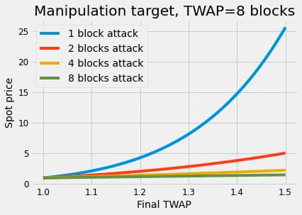
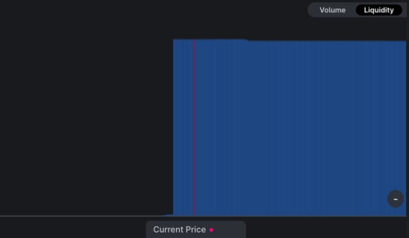
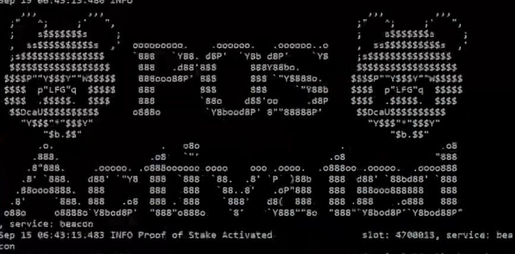
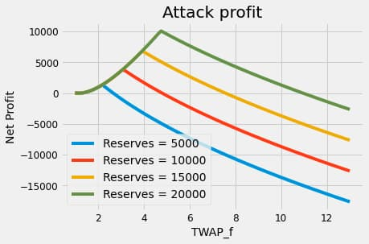

Author: [Parti](https://twitter.com/0xParticle)

## Intro

In our [last post](https://mirror.xyz/price-oracle.eth/wf_eF-PLnaoXeHRbiZ3VJiTn0Y8hwUrvmKwCK0M4M_I), we talked about the risks of using systems with centralized incentives and the issues that structure poses. Today, we would like to discuss the dangers of using liquidity pools (Uniswap v3 in particular) as a price oracle for any DeFi system.

Price manipulation is the primary concern with liquidity pool-based oracles such as Uniswap v3. With enough liquidity, anyone can manipulate any price in any market. But why would someone manipulate a market? How and when does that happen? If incentives are in place, manipulations WILL eventually occur. Despite the regulatory landscape, we even see this [behaviour](https://www.investopedia.com/terms/l/libor-scandal.asp) in Traditional Finance (TradFi).

We will focus here on the most common attack type in DeFi, which is targeted at lending protocols. We will discuss this case step by step so that conducting a similar analysis for different markets (synthetics, prediction markets, etc.) becomes straightforward.

For math-degens looking for a more rigorous analysis, check out the more math-focused article [here](https://defi.sucks/insights/oracle-manipulation-101-math-edition).

## But why?

But why would anyone manipulate a price? As usual, it's all about incentives. It will happen if the cost of manipulating an oracle is less than the profit gained. Additionally, regulations in the Web3 space are virtually nonexistent, making it easier for attackers to carry out their plans with no repercussions.

To understand the likelihood of an attack, we must compare the following:

1. Cost of Manipulation
2. Profit from Manipulation

Assuming the market participants are rational and are not trying to give money away, an oracle will stay safe if the manipulation cost is higher than the profit.

## 1. Cost of Manipulation

When evaluating Uniswap-based oracles, liquid Full Range positions are generally considered safer than concentrated positions. Moving the price over zero (or close to zero) liquidity regions is practically free, so manipulating becomes much more accessible. This claim is, of course, not always valid, but it is in most cases. For more information, see [here](https://uniswap.org/blog/uniswap-v3-oracles), [here](https://docs.euler.finance/euler-protocol/getting-started/methodology/oracle-rating), and the corresponding discussion in the [Math article](https://defi.sucks/insights/oracle-manipulation-101-math-edition).

However, not even liquid Full Range positions are risk-free. Remember that oracle users often differ from the protocols that provide liquidity for their token. Naturally, the interests between oracle users and the token holders providing liquidity can be misaligned. A lending market that accepts a specific token as collateral cannot know if the available Full Range position will be sticky. As a result, the lending market cannot confidently assign higher tiers/LTVs to them. This issue is one of the main points that [PRICE](https://oracles.rip/) solves.

In the analysis below, we will consider the Full Range positions due to the following:

1. Consistency with liquidity visibility and security claims.
2. Requirement for committed Full Range positions for the oracle to work. When adding concentrated positions on top, the manipulation cost will only increase; therefore, this analysis will serve as a "worst-case scenario".

The [Math article](https://defi.sucks/insights/oracle-manipulation-101-math-edition) shows the precise amounts required for manipulating the price in each direction. We have also discussed the $TWAP$, the average price the Uniswap v3 oracle library returns. The $TWAP$ replaced the spot price as a laggier but much safer way of using the oracle.

The following is a reasonably good approximation to compute the final spot price $P_f$ at which an attacker should manipulate the pool for the $TWAP$ to achieve a target value (remember the $TWAP$ is what the attack target reads when calling the oracle):

$P_f \simeq \sqrt[M]{\frac{TWAP^N}{P_i^{(N-M)}}} \hspace{1cm}(1)$

Where $P_i$ is the initial price of the pool, $N$ is the approximated number of blocks of the TWAP duration, and $M$ is the number of blocks covered by the attack.

## 2. Profit from Manipulation

Generalizing the value extracted from an attack is complex as it depends on the target. As we mentioned in the introduction, we will focus here on attacks on lending protocols. You can use the same approach to analyse attacks on different types of markets, such as synthetics, prediction markets, options, futures, etc.

There are two types of attacks on lending markets:

1. Manipulating the price of the collateral to the upside. This allows the attacker to borrow an excessive amount of tokens. The attacker then defaults/gets liquidated and sells the extra tokens for a profit.
2. Manipulating the price of the collateral to the downside. Doing so would trigger false liquidations, which the attacker might use to buy cheap / arbitrage on an external market.

In this post, we will focus on the first type of attack, which is the most common.

We will assume

- The lending market allows users to borrow a certain percentage of the collateral $f\in (0,1)$, which we call the LTV ratio: given $a$ tokens A (collateral) at a price $P$ (relative to B), the borrowing capacity (borrowable amount of B) equal to $f\times a\times P$.
- The lending market uses Uniswap v3 as an oracle source.

The core idea behind this attack is that borrowing and defaulting are equivalent to buying the borrowable asset with the collateral at a discounted price (due to the LTV) but with zero price impact. What? Slow down a bit:

- In both scenarios, the user inputs a certain amount of token A (as collateral or sold in the AMM) and outputs a certain amount of token B (borrowed or bought).
- The "discount" comes from the fact that liquidations are triggered based on the LTV ratio $f$. The lower the $f$, the more discount at which the asset is sold from the borrower's perspective.
- Borrowing, unlike buying in a pool, has no price impact. It is capped by the available reserves, though.

It's an arbitrage among markets with different math.

The stolen amount from the lending market attack after manipulating the spot price to $P_f$ to move the $TWAP$ to $TWAP_{final}$ is

$Stolen =min[faTWAP_{final}, Reserves]$

The stolen amount must be distinguished from the net Profit, as the manipulation costs and the liquidated collateral are not taken into account here. We will walk through this in the following section.

## Attack Scheme pre PoS

The regular scheme for attacking a lending market is via the following steps:

1. The attacker will use a total capital $C$ (measured in B): $C=C_{colateral}+C_{manipulation}$
2. With $C_{colateral}$, purchase $a_{colateral}$ of A at price $P_i$ (relative to B): $C_{colateral}=a_{colateral}P_i$. The attacker can do this over several blocks and liquidity markets to mitigate price impact. This step is unnecessary if efficient arbitrage exists (see Math article).
3. With $C_{manipulation}$, manipulate the $TWAP$ to $TWAP_{final}$, by purchasing $a_{manipulation}$ of token A in the AMM. The spot price to manipulate depends on the length of the TWAP queried by the market.
4. Deposit $a_{colateral}$ as collateral and borrow asset B with borrowing capacity $f*a_{colateral}*TWAP_{final}$. Notice the reserves cap this amount. If efficient arbitrage exists, deposit $a_{manipulation}$ instead.
5. If possible (no arbitrage), manipulate the price back to the starting value by selling back $a_{manipulation}$ (or what's left) of A and get at most $C_{manipulation}$ back. This step makes a huge difference in cost.
6. Default bad debt and profit. Notice the stolen capital B can be sold slowly over time to reduce price impact.

Before PoS, for relevant enough markets, manipulating the price back to the initial value was extremely unlikely for the attacker. Uniswap v3 Oracle requires a one-block delay to update, exposing the arbitrage opportunity and making the attack much more expensive (spoiler: this is what changed with PoS). [This paper](https://eprint.iacr.org/2022/445.pdf) showed that, if efficient arbitrage exists, a single-block attack becomes cheaper to execute than a multi-block attack (results are for Uniswap v2 $TWAP$, but are also valid for v3) for large enough manipulations.

### Healthy liquidity

Let's assume that the attacker knows that arbitrage will happen and that the pool has a Full Range position with liquidity $L$. In this situation, the best plan is to borrow as much as possible (sell high) using the capital obtained from the manipulation. They could then swap the difference for a price close to $P_i$.

> ✅ We showed in the [Math article](https://defi.sucks/insights/oracle-manipulation-101-math-edition) that this attack could be profitable only if the attack length is close to the length of the $TWAP$. This can be easily taken into account by setting the correct parameters.
>
> Attacking a pool with healthy liquidity was extremely hard to do pre-PoS.

> ⚠️ Incredibly, there are still markets using spot price as an oracle. We can see this mainly outside of Ethereum. A recent example was the attack on [Mango Markets](https://rekt.news/en/mango-markets-rekt/).

### Unhealthy liquidity

Two main factors can endanger $TWAP$-based oracle liquidity:

1. Bad liquidity positions in Uniswap v3: as we mentioned, a pool is, in most cases, easier to manipulate when liquidity is concentrated rather than over the Full Range. Price manipulation costs zero over regions with no liquidity.

1. No liquidity in secondary markets: there is no way for arbitrage to close the trade effectively. As we mentioned, the absence of arbitrage makes manipulation back to the initial price possible (the attacker recovers capital used for price manipulation). It also unlocks multi-block attacks (requires less upfront capital).

This is, for instance, what happened to the stablecoin FLOAT in Rari (see the FLOAT incident in Rari [here](https://etherscan.io/address/0xa2ce300cc17601fc660bac4eeb79bdd9ae61a0e5) and [here](https://www.defilatam.com/rekt/us-1-4-m-ataque-al-pool-90-de-rari-y-una-leccion-de-oracles-en-lending-para-aprendices)): liquidity was deployed only over the 1.16-1.74 USDC per FLOAT in Uniswap, which meant that manipulation cost was zero outside this range. As there was no liquidity in secondary markets, the attacker could wait for a few blocks and significantly impact the registered $TWAP$. Then, they proceeded to empty over $1M USD from the Pool 90 Fuse for only 10k FLOAT.

> ⚠️ These attacks are the most common for small projects.
>
> Attacks in these contexts are hard to distinguish from rug pulls. A lending market can protect itself by reverting the borrowing if the difference between $TWAP$ and spot price is large, but as time passes, the $TWAP$ will get close, and basic checks will pass.
>
> Both users and lending markets should be aware of these risks when using or listing low-liquidity tokens. PRICE will include additional methods to mitigate this risk.

## Attack Scheme Post PoS

After the Merge, big stakers have a [high chance](https://alrevuelta.github.io/posts/ethereum-mev-multiblock) of proposing multiple blocks in a row, which makes manipulation back to the initial price possible and significantly lowers the attack cost. It also makes TWAPs cheaper to move, as the attacker can maintain the manipulated price for longer.

Suppose the validator has $n>2$ consecutive blocks. In that case, the attacker can manipulate over $n-1$ blocks to reduce the initial capital required. In the final block $n$, they can exercise partial manipulation back to the initial price (or near it). As we have shown in Eq. (1), the final spot price to manipulate a $TWAP$ becomes closer to the initial price as the number of proposed blocks increases ($M$ in the equation). It's straightforward to show that the attack cost decreases enormously with this parameter. When protecting an oracle, we must be ready for the worst-case scenario, i.e. the post-PoS multi-block attack.

Suppose there is a delay of information (like Uniswap v3 $TWAP$) and no-arbitrage (PoS). In that case, some of the capital used for manipulation can be resold to the pool at the last block for higher values without altering the oracle price. Then, the remaining amount is collateral to default. Again, notice that borrowing to default is equivalent to selling at a diminished price due to $f$, with no price impact.

How would an optimal attack scheme look post-PoS for a validator with $n$ consecutive blocks?

1. Attack will use a total capital $C$ (measured in B): $C=C_{colateral}+C_{manipulation}$
2. With $C_{colateral}$, purchase $a_{colateral}$ of A at price $P_i$ (relative to B): $C_{colateral}=a_{colateral}P_i$. The attacker can do this over several blocks and liquidity markets to mitigate price impact.
3. With $C_{manipulation}$, manipulate the $TWAP$ to $TWAP_{final}$, by purchasing $a_{manipulation}$ of A in the AMM. The spot price to manipulate depends on the length of the TWAP queried by the market and how many blocks the proposer has at disposition.
4. Let $n-1$ block pass to register the new price.
5. Manipulate the price back in the AMM to $P_f'=f*TWAP_{final}$ by selling back $a_{back}$. The attacker still holds $a_{left} = a_{manipulation}-a_{back}$. Notice $a_{left}$ is equivalent to the amount out of manipulating the pool up to $P_f'$.
6. In the same block, deposit $a_{colateral}+a_{left}$ as colateral and borrow asset B with borrowing capacity $f(a_{colateral}+a_{left})TWAP_{final}$. Notice the reserves cap this amount.
7. Default bad debt and profit.

An attacker could also manipulate the TWAP without getting arbitraged if they propose several non-consecutive batches of blocks where they must sacrifice the final block of each batch to close the manipulation.

> ⚠️ The [Math article](https://defi.sucks/insights/oracle-manipulation-101-math-edition) shows that this attack can easily reach profitability, even after considering the $TWAP$. Increasing the $TWAP$ parameters will require the attacker to have a more significant up-front capital (redeemable after the attack). The absence of arbitrage in this scenario makes everything smoother from the attacker's perspective.

> ⚡ So, we are in danger once again…
>
> unless we use PRICE 🧠

## Conclusions

This article discussed manipulation events for lending markets using Uniswap v3 oracles.

We showed that previous to the PoS consensus, an attack on a lending market could be profitable only if the market used the spot price as an oracle or the liquidity was in an unhealthy shape, either by lousy deployment or absence in secondary markets.

With the recent switch to PoS, $TWAP$ oracle manipulation has become profitable again, even for pools with healthy liquidity. Multi-block proposing allows attackers to filter away interactions with a specific pool during their proposing window. A new approach is necessary to keep using Uniswap $TWAPs$ after the Merge, which PRICE brings to the table.

The following post will discuss the parameter selection used to design PRICE.

You can reach out to us on [Twitter](https://twitter.com/price_oracle) if you have any questions.

[Price](https://oracles.rip/)

Special t*hanks to [Guillaume Lambert](https://twitter.com/guil_lambert) and [Gaston Maffei](https://twitter.com/maffeigaston) for the review and feedback.*
